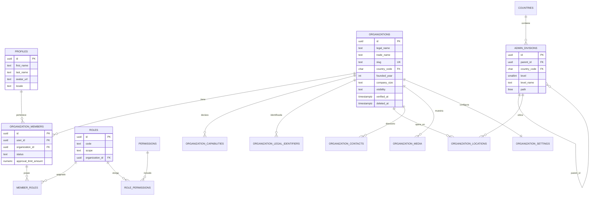
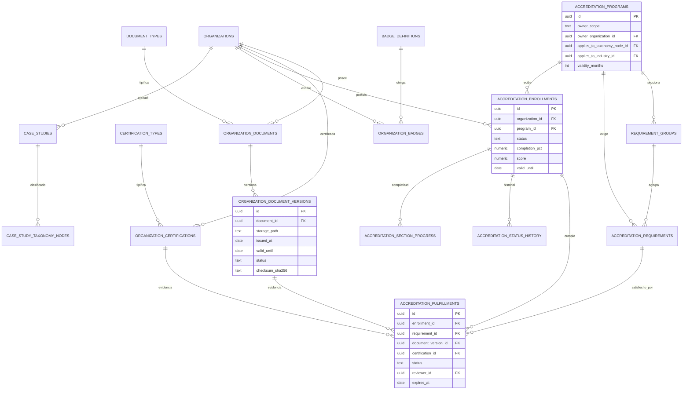
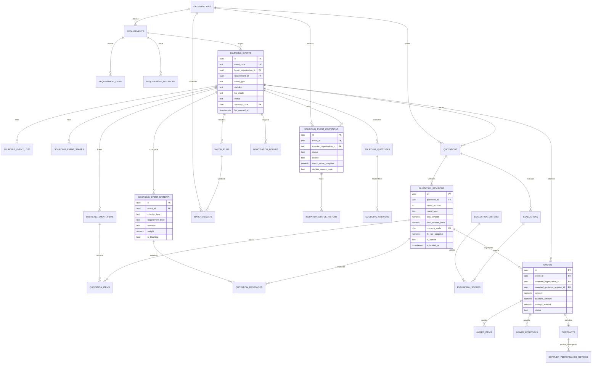

# 02 · Modelo de Datos

> Documento B + C + D del diseño técnico.
> ~110 tablas organizadas en 12 dominios. Formato: **tabla · finalidad · PK · FK principales · notas**.

---

## B. Modelo de datos — catálogo completo de tablas

### D0 · Identidad y multitenancy

| Tabla | Finalidad | PK | FK principales |
|---|---|---|---|
| `profiles` | Datos de la persona. Espejo 1:1 de `auth.users`, creado por trigger. Nombre, apellido, avatar, teléfono, idioma, zona horaria, `last_active_at`. | `id uuid` = `auth.users.id` | — |
| `organizations` | La empresa. Razón social, nombre comercial (`trade_name`), `slug` único, país, año constitución, tipo societario, tamaño, rango de dotación, rango de facturación, descripciones, propuesta de valor, `visibility`, `is_claimed`, `verified_at`, `deleted_at`. | `id uuid` | `country_code` → `countries` |
| `organization_capabilities` | Capacidades de sistema: `BUYER`, `SUPPLIER`, `PLATFORM_ADMIN`. Resuelve §4 sin encasillar. | `(organization_id, capability)` | → `organizations` |
| `organization_business_roles` | Roles declarativos de negocio: `MANDANTE`, `CONTRATISTA`, `SUBCONTRATISTA`, `FABRICANTE`, `DISTRIBUIDOR`, `REPRESENTANTE`, `CONSULTORA`, `OTEC`. No afectan permisos. | `(organization_id, business_role)` | → `organizations` |
| `organization_legal_identifiers` | Identificadores tributarios multi-país (RUT CL, RFC MX, CUIT AR, DUNS, VAT). Evita el `tax_id text` único que no escala internacionalmente. | `id uuid` | → `organizations`, `countries` |
| `organization_members` | Pertenencia persona↔empresa. `status`, `joined_at`, `invited_by`, `approval_limit_amount` (para DoA). `unique(user_id, organization_id)`. | `id uuid` | → `profiles`, `organizations` |
| `roles` | Catálogo de roles. `scope ∈ {PLATFORM, ORGANIZATION}`, `is_system`, `organization_id` nulo salvo rol custom. | `id uuid` | → `organizations` (nullable) |
| `permissions` | Permisos atómicos: `sourcing_event.create`, `quotation.read`, `award.approve`, … ~60 filas. | `code text` | — |
| `role_permissions` | Rol → permisos. | `(role_id, permission_code)` | → `roles`, `permissions` |
| `member_roles` | Miembro → N roles. | `(member_id, role_id)` | → `organization_members`, `roles` |
| `organization_invitations` | Invitar personas al equipo por email. Token, expiración, rol propuesto, estado. | `id uuid` | → `organizations`, `profiles` |
| `organization_locations` | Casa matriz, sucursales, bases operacionales. Tipo, dirección, `admin_division_id`, `lat/lng`, `is_headquarters`. | `id uuid` | → `organizations`, `admin_divisions` |
| `organization_contacts` | Directorio de contactos (§6). Nombre, cargo, área, `contact_type`, email, teléfono, WhatsApp, LinkedIn, `is_public`, `is_primary`. | `id uuid` | → `organizations` |
| `organization_media` | Logo, banner, galería, video corporativo. `media_type`, `storage_path`, `sort_order`. | `id uuid` | → `organizations` |
| `organization_settings` | Preferencias: visibilidad por bloque de perfil, moneda base, idioma, notificaciones por defecto. 1:1. | `organization_id uuid` | → `organizations` |
| `organization_claims` | Flujo "reclama tu empresa" para perfiles pre-cargados. Evidencia, revisor, estado. | `id uuid` | → `organizations`, `profiles` |

### D1 · Datos de referencia

| Tabla | Finalidad | PK | FK principales |
|---|---|---|---|
| `countries` | ISO-3166. Nombre, moneda por defecto, prefijo telefónico, `is_active`. | `code char(2)` | — |
| `admin_divisions` | **Jerarquía territorial genérica multi-país**: región → provincia → comuna. `parent_id`, `level` (1..4), `level_name` (`REGION`/`PROVINCIA`/`COMUNA`), `path ltree`, `lat/lng`, código oficial (CUT del INE en Chile). Reemplaza `regions`+`cities` rígidas. | `id uuid` | `parent_id` → self, `country_code` |
| `currencies` | ISO-4217 + unidades de indexación chilenas (**UF**, **UTM**), con `is_index_unit`. | `code char(3)` | — |
| `fx_rates` | Tipo de cambio diario `(from, to, rate, valid_on, source)`. Incluye UF/UTM→CLP. Fuente: Banco Central / SII. | `(from_code,to_code,valid_on)` | → `currencies` |
| `units_of_measure` | UOM normalizadas (UN, HH, KM, TON, M3, MES, GLOBAL) con familia y factor de conversión. | `code text` | — |
| `languages` | Idiomas soportados para i18n de catálogos. | `code char(5)` | — |

### D2 · Taxonomía de oferta e industrias

| Tabla | Finalidad | PK | FK principales |
|---|---|---|---|
| `taxonomy_nodes` | **Árbol único de QUÉ se vende**, profundidad variable. `parent_id`, `level`, `node_type ∈ {CATEGORY, SUBCATEGORY, SPECIALTY, SERVICE, PRODUCT}`, `path ltree`, `slug`, `is_leaf`, `is_active`, `sort_order`, `risk_level`. | `id uuid` | `parent_id` → self |
| `taxonomy_node_translations` | Nombre y descripción por idioma. | `(node_id, language_code)` | → `taxonomy_nodes`, `languages` |
| `taxonomy_node_synonyms` | Sinónimos y jerga para búsqueda ("camión pluma"↔"camión grúa", "colación"↔"alimentación"). Alimenta FTS. | `id uuid` | → `taxonomy_nodes` |
| `taxonomy_external_mappings` | Mapeo a estándares (`UNSPSC`, `CPC`, `NACE`) para interoperabilidad con ERPs de clientes enterprise. | `id uuid` | → `taxonomy_nodes` |
| `industries` | **Árbol independiente de A QUIÉN se vende**: Minería → Cobre / Litio / Plantas concentradoras / Fundiciones / Puertos. `parent_id`, `path ltree`, `slug`. | `id uuid` | `parent_id` → self |
| `industry_translations` | i18n de industrias. | `(industry_id, language_code)` | → `industries` |
| `organization_industries` | Industrias que atiende la empresa, con `years_experience`, `is_primary`, `evidence_case_study_id`. | `(organization_id, industry_id)` | → `organizations`, `industries` |

### D3 · Atributos dinámicos

| Tabla | Finalidad | PK | FK principales |
|---|---|---|---|
| `attribute_definitions` | Registro global de atributos. `code`, `data_type ∈ {TEXT,NUMBER,BOOLEAN,DATE,SELECT,MULTISELECT,RANGE}`, `unit_code`, `min/max`, `is_filterable`, `is_comparable`, `help_text`. Reutilizable entre categorías. | `id uuid` | → `units_of_measure` |
| `attribute_options` | Opciones para SELECT/MULTISELECT. `value`, `label`, `sort_order`, `is_active`. | `id uuid` | → `attribute_definitions` |
| `taxonomy_node_attributes` | **Enlaza atributo ↔ nodo de taxonomía.** `applies_to ∈ {OFFERING, REQUIREMENT, ORGANIZATION}`, `is_required`, `is_inherited` (baja a los hijos), `filter_weight`, `sort_order`. | `id uuid` | → `taxonomy_nodes`, `attribute_definitions` |
| `offering_attribute_values` | Valor declarado por el proveedor. Columnas tipadas: `value_text`, `value_number`, `value_boolean`, `value_date`, `value_range numrange`, `option_id`. CHECK: exactamente una poblada según `data_type`. | `id uuid` | → `supplier_offerings`, `attribute_definitions`, `attribute_options` |
| `offering_attribute_option_values` | Valores múltiples para MULTISELECT. | `(offering_attribute_value_id, option_id)` | → arriba |
| `requirement_attribute_conditions` | **Condición** solicitada por el comprador: mismo set tipado + `operator ∈ {EQ,NEQ,GT,GTE,LT,LTE,IN,NOT_IN,CONTAINS,BETWEEN}` + `requirement_level ∈ {MUST, NICE}` + `weight`. | `id uuid` | → `sourcing_events`/`requirements`, `attribute_definitions` |
| `organization_attribute_values` | Atributos a nivel empresa (dotación total, flota total, ISO vigentes). Misma estructura tipada. | `id uuid` | → `organizations`, `attribute_definitions` |

### D4 · Oferta comercial (el núcleo)

| Tabla | Finalidad | PK | FK principales |
|---|---|---|---|
| `supplier_offerings` | **La unidad atómica.** Un producto/servicio/arriendo/software/capacitación/consultoría que la empresa vende. `offering_type`, `name`, `slug`, `short_description`, `full_description`, `specifications`, `applications`, `brand`, `model`, `lead_time_days`, `moq`, `monthly_capacity`, `capacity_unit`, `warranty_months`, `has_after_sales`, `availability_status`, `visibility`, `status`, `published_at`, `deleted_at`. | `id uuid` | → `organizations` |
| `offering_taxonomy_nodes` | Un offering puede colgar de N nodos; uno es `is_primary`. | `(offering_id, node_id)` | → `supplier_offerings`, `taxonomy_nodes` |
| `offering_industries` | Industrias objetivo del offering (no de la empresa). | `(offering_id, industry_id)` | → `supplier_offerings`, `industries` |
| `offering_territories` | Dónde se presta ESE servicio. `admin_division_id` (a cualquier nivel), `coverage_type ∈ {OPERATIONAL, COMMERCIAL, MOBILIZABLE}`, `mobilization_days`, `has_local_base`. | `id uuid` | → `supplier_offerings`, `admin_divisions` |
| `offering_pricing` | Precio referencial opcional: `price_type ∈ {FIXED, FROM, RANGE, ON_REQUEST}`, `amount_min/max`, `currency_code`, `unit_code`, `valid_until`, `is_public`. | `id uuid` | → `supplier_offerings`, `currencies`, `units_of_measure` |
| `offering_media` | Fotos, videos, renders. | `id uuid` | → `supplier_offerings` |
| `offering_documents` | Fichas técnicas, catálogos PDF, manuales. `is_public`. | `id uuid` | → `supplier_offerings` |
| `offering_certifications` | Certificaciones asociadas a ese offering específico. | `(offering_id, certification_id)` | → `supplier_offerings`, `organization_certifications` |
| `organization_territories` | Cobertura declarada a nivel empresa (para búsqueda gruesa y perfil). Deriva de la unión de `offering_territories` pero es editable. | `id uuid` | → `organizations`, `admin_divisions` |

### D5 · Credenciales, experiencia y confianza

| Tabla | Finalidad | PK | FK principales |
|---|---|---|---|
| `document_types` | Catálogo de tipos documentales: código, nombre, país, `category` (LEGAL/TRIBUTARIO/LABORAL/FINANCIERO/SSO/SEGUROS), `requires_expiry`, `default_validity_days`, `is_sensitive`. Ej.: `F30`, `F30_1`, `CARPETA_TRIBUTARIA`, `VIGENCIA_SOCIEDAD`. | `id uuid` | → `countries` |
| `organization_documents` | **Repositorio único.** Un documento lógico por empresa y tipo. Se sube una vez y se reutiliza en todos los programas de acreditación. | `id uuid` | → `organizations`, `document_types` |
| `organization_document_versions` | Versión concreta con archivo. `storage_path`, `issued_at`, `valid_from`, `valid_until`, `status`, `checksum`, `uploaded_by`. Append-only. | `id uuid` | → `organization_documents` |
| `certification_types` | ISO 9001/14001/45001/27001, mutualidad, sellos sectoriales. `issuing_body`, `requires_scope`, `requires_expiry`. | `id uuid` | — |
| `organization_certifications` | Certificación que posee la empresa. `certificate_number`, `scope`, `issued_by`, `issued_at`, `valid_until`, `document_version_id`, `verification_status`. | `id uuid` | → `organizations`, `certification_types`, `organization_document_versions` |
| `client_references` | Clientes declarados. `client_organization_id` (si está en la plataforma) o `client_name` libre, `industry_id`, `since`, `is_public`, `is_verified`. | `id uuid` | → `organizations`, `industries` |
| `case_studies` | Proyectos y casos de éxito (§17). Nombre, cliente, industria, servicio, `admin_division_id`, fechas, duración, descripción, resultados, `reference_contact_id`, `is_public`, `verification_status`. | `id uuid` | → `organizations`, `industries`, `admin_divisions`, `organization_contacts` |
| `case_study_media` | Fotos y evidencias del caso. | `id uuid` | → `case_studies` |
| `case_study_taxonomy_nodes` | Qué se ejecutó, clasificado — así la experiencia es *matcheable*, no solo texto. | `(case_study_id, node_id)` | → `case_studies`, `taxonomy_nodes` |
| `verification_checks` | Verificaciones automatizadas o manuales (existencia SII, vigencia societaria, email corporativo, dominio web). `check_type`, `result`, `evidence`, `checked_at`. | `id uuid` | → `organizations` |

### D6 · Acreditación

| Tabla | Finalidad | PK | FK principales |
|---|---|---|---|
| `accreditation_programs` | Programa de exigencias. `owner_scope ∈ {PLATFORM, ORGANIZATION}`, `owner_organization_id`, `name`, `applies_to_taxonomy_node_id`, `applies_to_industry_id`, `applies_to_risk_level`, `country_code`, `validity_months`, `is_active`. Resuelve §13 completo. | `id uuid` | → `organizations`, `taxonomy_nodes`, `industries` |
| `requirement_groups` | Secciones del programa (Perfil, Tributario, Legal, SSO, Financiero, Experiencia) con peso. Alimenta la vista de completitud del §11. | `id uuid` | → `accreditation_programs` |
| `accreditation_requirements` | Ítem exigido. `requirement_kind ∈ {DOCUMENT, CERTIFICATION, ATTRIBUTE, DECLARATION, FORM}`, `document_type_id`/`certification_type_id`/`attribute_definition_id`, `is_mandatory`, `weight`, `min_validity_days`, `reviewer_role`. | `id uuid` | → `accreditation_programs`, `requirement_groups`, `document_types`, `certification_types` |
| `accreditation_enrollments` | **Estado de una empresa en un programa.** `status`, `completion_pct`, `score`, `valid_from`, `valid_until`, `submitted_at`, `decided_at`, `decided_by`. `unique(organization_id, program_id)`. | `id uuid` | → `organizations`, `accreditation_programs` |
| `accreditation_fulfillments` | Cumplimiento ítem a ítem. Evidencia por FK (`document_version_id` / `certification_id` / valor de atributo), `status`, `reviewer_id`, `reviewed_at`, `observation`, `expires_at`. | `id uuid` | → `accreditation_enrollments`, `accreditation_requirements`, `organization_document_versions`, `organization_certifications` |
| `accreditation_section_progress` | Materializado por trigger: % por `requirement_group`. Es lo que se pinta en pantalla. | `(enrollment_id, group_id)` | → arriba |
| `accreditation_status_history` | Append-only: cada cambio de estado con actor, motivo y timestamp. | `id uuid` | → `accreditation_enrollments` |
| `accreditation_review_events` | Bitácora de revisión: observaciones, solicitudes de subsanación, respuestas del proveedor. | `id uuid` | → `accreditation_fulfillments` |
| `accreditation_status_transitions` | Transiciones permitidas (datos, no código). | `(from_status,to_status)` | — |
| `badge_definitions` | Badges (§14). `code`, `name`, `icon`, `rule_expression jsonb`, `is_automatic`, `validity_days`, `is_sponsored` (siempre false para badges de confianza). | `id uuid` | — |
| `organization_badges` | Badge otorgado. `granted_at`, `expires_at`, `evidence jsonb`, `granted_by`, `revoked_at`. | `id uuid` | → `organizations`, `badge_definitions` |

### D7 · Relación comprador ↔ proveedor

| Tabla | Finalidad | PK | FK principales |
|---|---|---|---|
| `buyer_supplier_relationships` | **Approved Vendor List** privada del comprador (§33). `status ∈ {POTENTIAL, IN_EVALUATION, APPROVED, CONDITIONAL, SUSPENDED, BLOCKED}`, `internal_code` (código en su ERP), `is_critical`, `approved_until`, `owner_member_id`. Independiente de la acreditación de plataforma. | `id uuid` | → `organizations` (buyer y supplier) |
| `buyer_supplier_notes` | Notas privadas del comprador sobre el proveedor. Nunca visibles al proveedor. | `id uuid` | → `buyer_supplier_relationships` |
| `supplier_lists` | Listas curadas: "Transportistas Antofagasta", "Proveedores críticos". `is_shared_with_org`. | `id uuid` | → `organizations` |
| `supplier_list_items` | Ítems de la lista, con nota y `sort_order`. | `id uuid` | → `supplier_lists`, `organizations` |
| `saved_searches` | Búsqueda guardada: `query_text`, `filters jsonb` (aquí JSON **sí** es correcto: es un snapshot de UI, no dato de negocio), `alert_enabled`, `alert_frequency`. | `id uuid` | → `organizations`, `profiles` |
| `supplier_alerts` | Alertas del proveedor sobre oportunidades (§90): filtros por categoría, industria, territorio. | `id uuid` | → `organizations` |
| `alert_deliveries` | Qué se notificó y cuándo, para no repetir. | `id uuid` | → `saved_searches`/`supplier_alerts` |

### D8 · Demanda y sourcing

| Tabla | Finalidad | PK | FK principales |
|---|---|---|---|
| `requirements` | La necesidad (§18). Nombre, descripción, `primary_taxonomy_node_id`, `industry_id`, fechas requeridas, duración, presupuesto estimado + moneda, condiciones comerciales y de pago, `status`, `source ∈ {FORM, FREE_TEXT, DISCOVERY}`, `raw_input_text` (para IA V2). | `id uuid` | → `organizations`, `taxonomy_nodes`, `industries` |
| `requirement_items` | Líneas de la necesidad: descripción, cantidad, unidad, especificaciones. | `id uuid` | → `requirements`, `units_of_measure` |
| `requirement_locations` | Dónde se ejecuta. | `id uuid` | → `requirements`, `admin_divisions` |
| `requirement_documents` | Adjuntos. | `id uuid` | → `requirements` |
| `sourcing_events` | **El proceso.** `event_code` legible (RFQ-2026-0142), `event_type ∈ {RFI, RFQ, RFP, QUICK_BUY, DIRECT_AWARD}`, `visibility`, `bid_mode ∈ {OPEN, SEALED}`, `status`, `currency_code`, `estimated_amount`, `requires_nda`, `requires_accreditation_program_id`, `max_invitations`, `bid_opened_at`, `bid_opened_by`. | `id uuid` | → `organizations`, `requirements`, `accreditation_programs` |
| `sourcing_event_lots` | Lotes adjudicables por separado. | `id uuid` | → `sourcing_events` |
| `sourcing_event_items` | Líneas a cotizar: descripción, cantidad, unidad, `taxonomy_node_id`, `is_optional`. **La cotización se estructura contra estas líneas.** | `id uuid` | → `sourcing_events`, `sourcing_event_lots`, `units_of_measure` |
| `sourcing_event_criteria` | **MUST_HAVE / NICE_TO_HAVE** (§55). `criterion_type ∈ {ATTRIBUTE, CERTIFICATION, ACCREDITATION, TERRITORY, EXPERIENCE_YEARS, INDUSTRY_EXPERIENCE, CAPACITY, CUSTOM}`, referencia tipada, `operator`, valor, `weight`, `is_blocking`. | `id uuid` | → `sourcing_events`, `attribute_definitions`, `certification_types` |
| `sourcing_event_stages` | Hitos: publicación, cierre de consultas, cierre de ofertas, apertura, evaluación, adjudicación estimada. | `id uuid` | → `sourcing_events` |
| `sourcing_event_documents` | Bases, planos, anexos. `requires_nda`. | `id uuid` | → `sourcing_events` |
| `sourcing_event_ndas` | Texto/plantilla de NDA del evento, versión. | `id uuid` | → `sourcing_events` |
| `nda_acceptances` | Aceptación registrada: quién, cuándo, IP, hash del texto aceptado. | `id uuid` | → `sourcing_event_ndas`, `organizations`, `profiles` |
| `sourcing_event_invitations` | Participación del proveedor. `status` (máquina de 11 estados), `invited_at`, `viewed_at`, `responded_at`, `decline_reason_code`, `source ∈ {MATCH, MANUAL, LIST, PUBLIC_APPLY}`, `match_score_snapshot`. | `id uuid` | → `sourcing_events`, `organizations` |
| `invitation_status_history` | Cada transición, append-only. Base de la analítica de tasa de respuesta. | `id uuid` | → `sourcing_event_invitations` |
| `sourcing_questions` | Consultas del proveedor. `asked_by_organization_id`, `asked_at`, `is_answered`. | `id uuid` | → `sourcing_events`, `organizations` |
| `sourcing_answers` | Respuesta del comprador. `visibility ∈ {PRIVATE_TO_ASKER, ALL_PARTICIPANTS}`, `answered_by`, `published_at`. Al publicar a todos, se anonimiza el autor de la pregunta. | `id uuid` | → `sourcing_questions` |
| `match_runs` | Una corrida del motor. `engine_version`, `weights_snapshot jsonb`, `executed_at`, `duration_ms`, `candidates_evaluated`. Reproducibilidad. | `id uuid` | → `sourcing_events` |
| `match_results` | Resultado por candidato. `organization_id`, `offering_id`, `total_score`, `is_eligible`, `blocking_reasons text[]`, `score_breakdown jsonb`, `rank`. | `id uuid` | → `match_runs`, `organizations`, `supplier_offerings` |

### D9 · Cotizaciones, evaluación y adjudicación

| Tabla | Finalidad | PK | FK principales |
|---|---|---|---|
| `quotations` | **Contenedor** de la oferta de un proveedor en un evento. `unique(event_id, supplier_organization_id)`. Guarda `current_revision_id`, `status`, `first_submitted_at`. Sin montos. | `id uuid` | → `sourcing_events`, `organizations` |
| `quotation_revisions` | **Append-only.** Una fila por envío/ronda. `round_number`, `round_type ∈ {INITIAL, CLARIFICATION, COUNTER, BAFO}`, `submitted_at`, `submitted_by`, `valid_until`, `currency_code`, `fx_rate_snapshot`, `subtotal`, `tax_amount`, `total_amount`, `total_amount_base`, `payment_terms`, `delivery_days`, `warranty_terms`, `exclusions`, `notes`, `is_current`. **Nunca UPDATE tras enviar.** | `id uuid` | → `quotations`, `currencies` |
| `quotation_items` | Línea a línea, contra `sourcing_event_items`. `quantity`, `unit_code`, `unit_price`, `discount_pct`, `tax_rate`, `line_total`, `lead_time_days`, `brand`, `model`, `notes`. Cuelga de la **revisión**, no de la cotización. | `id uuid` | → `quotation_revisions`, `sourcing_event_items`, `units_of_measure` |
| `quotation_responses` | Respuesta del proveedor a cada `sourcing_event_criteria` (cumple / no cumple / valor / evidencia). Alimenta el comparador técnico. | `id uuid` | → `quotation_revisions`, `sourcing_event_criteria` |
| `quotation_documents` | Anexos de la oferta. | `id uuid` | → `quotation_revisions` |
| `negotiation_rounds` | Ronda de negociación abierta por el comprador: `round_type`, `instructions`, `deadline`, `target_reduction_pct`, participantes convocados. | `id uuid` | → `sourcing_events` |
| `negotiation_round_participants` | Qué proveedores fueron convocados a la ronda y qué revisión presentaron. | `id uuid` | → `negotiation_rounds`, `quotations` |
| `evaluation_templates` | Plantilla reutilizable de evaluación por categoría o empresa. | `id uuid` | → `organizations`, `taxonomy_nodes` |
| `evaluation_criteria` | Criterio con `dimension ∈ {TECHNICAL, COMMERCIAL, HSE, LEGAL, FINANCIAL}`, `weight`, `scale_min/max`, `scoring_guide`. | `id uuid` | → `evaluation_templates` |
| `event_evaluation_setup` | Plantilla y ponderaciones aplicadas a un evento concreto (snapshot, para que cambiar la plantilla no altere procesos cerrados). | `id uuid` | → `sourcing_events`, `evaluation_templates` |
| `evaluation_assignments` | Comité: quién evalúa qué dimensión, con `can_view_commercial` (bloqueo económico para evaluadores técnicos). | `id uuid` | → `sourcing_events`, `organization_members` |
| `evaluations` | Cabecera de la evaluación de un evaluador sobre una cotización. `status`, `submitted_at`. | `id uuid` | → `quotations`, `organization_members` |
| `evaluation_scores` | Puntaje por criterio: `score`, `comment`, `evidence_document_id`. | `id uuid` | → `evaluations`, `evaluation_criteria` |
| `quotation_comparisons` | Snapshot del comparador con ponderaciones usadas y ranking resultante. Justifica la decisión ante auditoría. | `id uuid` | → `sourcing_events` |
| `awards` | Adjudicación. `awarded_organization_id`, `awarded_quotation_revision_id`, `amount`, `currency_code`, `amount_base`, `justification`, `status`, `awarded_at`, `awarded_by`, `baseline_amount` y `savings_amount` (ver mejora N.10). | `id uuid` | → `sourcing_events`, `organizations`, `quotation_revisions` |
| `award_items` | Adjudicación parcial: qué líneas/lotes a qué proveedor. Permite multi-adjudicación. | `id uuid` | → `awards`, `sourcing_event_items` |
| `award_approvals` | Cadena DoA: `step_order`, `approver_member_id`, `status`, `decided_at`, `comment`. | `id uuid` | → `awards`, `organization_members` |
| `organization_approval_policies` | Reglas de aprobación por monto y categoría de la empresa compradora. | `id uuid` | → `organizations` |
| `purchase_orders` | OC opcional generada desde el award. | `id uuid` | → `awards` |

### D10 · Contratos y desempeño

| Tabla | Finalidad | PK | FK principales |
|---|---|---|---|
| `contracts` | Contrato (§45). `contract_number`, buyer/supplier, `award_id`, fechas, monto, moneda, `renewal_type`, `auto_renew`, `contract_manager_member_id`, `status`. | `id uuid` | → `organizations`, `awards` |
| `contract_milestones` | Hitos y entregables con fecha y estado. | `id uuid` | → `contracts` |
| `contract_slas` | SLA medibles: métrica, objetivo, penalidad. | `id uuid` | → `contracts` |
| `contract_documents` | Contrato firmado, anexos, boletas de garantía, estados de pago. | `id uuid` | → `contracts` |
| `contract_amendments` | Modificaciones contractuales, append-only. | `id uuid` | → `contracts` |
| `supplier_performance_reviews` | Evaluación post-servicio (§30). Ligada a `contract_id` o `award_id` — **solo puede evaluar quien compró de verdad**. | `id uuid` | → `organizations`, `contracts`, `awards` |
| `performance_dimensions` | Catálogo: calidad, seguridad, cumplimiento de plazos, precio, comunicación, documentación, postventa, cumplimiento normativo. | `code text` | — |
| `supplier_performance_scores` | Puntaje por dimensión, con comentario. Nunca una sola estrella. | `id uuid` | → `supplier_performance_reviews`, `performance_dimensions` |
| `supplier_incidents` | Reclamos, no conformidades, incidentes de seguridad. `severity`, `status`, `resolved_at`. | `id uuid` | → `organizations` |
| `supplier_scores` | **Snapshot calculado** del Supplier Score. `total_score`, `formula_version`, `calculated_at`, `valid_until`. Histórico: no se sobrescribe. | `id uuid` | → `organizations` |
| `supplier_score_components` | Desglose por componente con valor crudo, valor normalizado y peso. Hace el score auditable y explicable. | `id uuid` | → `supplier_scores` |

### D11 · Colaboración

| Tabla | Finalidad | PK | FK principales |
|---|---|---|---|
| `conversations` | Hilo **con contexto tipado**: `context_type ∈ {ORGANIZATION, OFFERING, REQUIREMENT, SOURCING_EVENT, QUOTATION, CONTRACT}` + `context_id` + FK específicas nullables (no polimorfismo ciego: hay FK reales `sourcing_event_id`, `quotation_id`, etc., con CHECK de coherencia). | `id uuid` | → múltiples |
| `conversation_participants` | Organización + miembro participante, `last_read_at`, `is_muted`. | `id uuid` | → `conversations`, `organizations`, `organization_members` |
| `messages` | Mensaje. `body`, `sender_member_id`, `sender_organization_id`, `is_system`, `edited_at`, `deleted_at`. | `id uuid` | → `conversations` |
| `message_attachments` | Adjuntos con metadatos y checksum. | `id uuid` | → `messages` |
| `message_reads` | Lecturas por participante. | `(message_id, member_id)` | → `messages` |
| `notifications` | Notificación in-app. `type`, `title`, `body`, `entity_type`, `entity_id`, `action_url`, `read_at`, `priority`. | `id uuid` | → `profiles`, `organizations` |
| `notification_preferences` | Preferencias por tipo y canal (in-app / email / push / whatsapp). | `id uuid` | → `profiles`, `organizations` |
| `notification_deliveries` | Envío por canal: `channel`, `status`, `provider_message_id`, `sent_at`, `error`. Preparado para push y WhatsApp sin cambiar el modelo. | `id uuid` | → `notifications` |

### D12 · Búsqueda, analítica y operación de plataforma

| Tabla | Finalidad | PK | FK principales |
|---|---|---|---|
| `supplier_search_index` | **Read model desnormalizado**, 1 fila por offering: `tsvector` combinado, arrays de `node_ids`/`industry_ids`/`division_ids`/`certification_ids`, flags de acreditación, `supplier_score`, `attributes jsonb` (proyección derivada). Refrescado por trigger + job. | `offering_id uuid` | → `supplier_offerings` |
| `search_logs` | Cada búsqueda: texto, filtros, nº de resultados, org que buscó, `result_offering_ids`. Base de "categorías más demandadas" y de detección de gaps de oferta. | `id uuid` | → `organizations` |
| `search_impressions` | Apariciones de un proveedor en resultados (§39, §71: "apareciste en 120 búsquedas"). Agregado diario. | `id uuid` | → `organizations`, `supplier_offerings` |
| `profile_views` | Visitas al perfil público. Viewer org (si registrado), `source`, `is_unique`. | `id uuid` | → `organizations` |
| `offering_views` | Visitas a fichas de catálogo. | `id uuid` | → `supplier_offerings` |
| `domain_events` | **Outbox**: `event_type`, `aggregate_type`, `aggregate_id`, `payload jsonb`, `occurred_at`, `processed_at`. Único punto desde el que se disparan notificaciones, analítica e integraciones. | `id bigint` | — |
| `activity_logs` | Actividad de negocio visible al usuario ("Juan invitó a 6 proveedores"). | `id uuid` | → `organizations`, `profiles` |
| `audit_logs` | Auditoría inmutable (§52): `user_id`, `organization_id`, `action`, `entity_type`, `entity_id`, `previous_value jsonb`, `new_value jsonb`, `ip_address`, `user_agent`, `occurred_at`. Particionada por mes, sin UPDATE/DELETE. | `id bigint` | — |
| `marketplace_metrics_daily` | Agregados del §68/§69: proveedores, acreditados, RFQ, cotizaciones/RFQ, % RFQ sin ofertas, tiempo a primera oferta, por día/categoría/región. | `(metric_date, dimension, dimension_id)` | — |
| `plans` | Planes SaaS (§58). | `id uuid` | — |
| `plan_entitlements` | Límites y features por plan: `feature_code`, `limit_value`, `is_unlimited`. Evita `if plan == 'PRO'` en el código. | `id uuid` | → `plans` |
| `subscriptions` | Suscripción de la organización: plan, periodo, estado, `trial_ends_at`. | `id uuid` | → `organizations`, `plans` |
| `usage_counters` | Consumo del periodo (RFQ creadas, invitaciones, usuarios). | `id uuid` | → `organizations` |
| `billing_events` | Eventos de facturación / pasarela. | `id uuid` | → `organizations` |
| `sponsored_placements` | Posiciones patrocinadas, **estrictamente separadas** del ranking orgánico y etiquetadas en UI. | `id uuid` | → `organizations`, `taxonomy_nodes` |
| `reports` | Denuncias (§61): empresa/publicación/review, motivo, estado. | `id uuid` | → `organizations`, `profiles` |
| `moderation_actions` | Acción tomada: advertencia, ocultamiento, suspensión, bloqueo. | `id uuid` | → `reports` |
| `feature_flags` | Flags por plataforma / organización. | `id uuid` | → `organizations` |

**Total ≈ 112 tablas.** Del listado original del brief (§47) se conservan las esenciales; se **eliminaron** `subcategories`, `specialties`, `services`, `products`, `regions`, `cities`, `favorites` y `clients` por quedar subsumidas en estructuras jerárquicas o más generales; se **agregaron** ~50 (atributos, versiones, aprobaciones, outbox, entitlements, read model, moderación).

---

## C. Diagramas ER

> Cuatro diagramas focalizados en lugar de uno ilegible. Sintaxis Mermaid.

### C.1 Identidad, multitenancy y perfil de empresa



### C.2 Taxonomía, atributos dinámicos y oferta

```mermaid
erDiagram
    TAXONOMY_NODES ||--o{ TAXONOMY_NODES : "parent_id"
    TAXONOMY_NODES ||--o{ TAXONOMY_NODE_TRANSLATIONS : "i18n"
    TAXONOMY_NODES ||--o{ TAXONOMY_NODE_SYNONYMS : "alias"
    TAXONOMY_NODES ||--o{ TAXONOMY_NODE_ATTRIBUTES : "exige"
    ATTRIBUTE_DEFINITIONS ||--o{ TAXONOMY_NODE_ATTRIBUTES : "aplicado_en"
    ATTRIBUTE_DEFINITIONS ||--o{ ATTRIBUTE_OPTIONS : "opciones"
    ATTRIBUTE_DEFINITIONS ||--o{ OFFERING_ATTRIBUTE_VALUES : "valorizado"
    ATTRIBUTE_DEFINITIONS ||--o{ REQUIREMENT_ATTRIBUTE_CONDITIONS : "condicionado"

    ORGANIZATIONS ||--o{ SUPPLIER_OFFERINGS : "publica"
    SUPPLIER_OFFERINGS ||--o{ OFFERING_TAXONOMY_NODES : "clasificado"
    TAXONOMY_NODES ||--o{ OFFERING_TAXONOMY_NODES : "agrupa"
    SUPPLIER_OFFERINGS ||--o{ OFFERING_TERRITORIES : "cubre"
    SUPPLIER_OFFERINGS ||--o{ OFFERING_ATTRIBUTE_VALUES : "describe"
    SUPPLIER_OFFERINGS ||--o{ OFFERING_INDUSTRIES : "dirigido_a"
    SUPPLIER_OFFERINGS ||--o{ OFFERING_PRICING : "precio"
    SUPPLIER_OFFERINGS ||--o{ OFFERING_MEDIA : "media"
    SUPPLIER_OFFERINGS ||--|| SUPPLIER_SEARCH_INDEX : "indexado"
    INDUSTRIES ||--o{ INDUSTRIES : "parent_id"
    INDUSTRIES ||--o{ OFFERING_INDUSTRIES : "objetivo"
    ADMIN_DIVISIONS ||--o{ OFFERING_TERRITORIES : "territorio"

    TAXONOMY_NODES {
        uuid id PK
        uuid parent_id FK
        smallint level
        text node_type
        ltree path
        text slug UK
        bool is_leaf
        text risk_level
    }
    ATTRIBUTE_DEFINITIONS {
        uuid id PK
        text code UK
        text data_type
        text unit_code FK
        bool is_filterable
        bool is_comparable
    }
    TAXONOMY_NODE_ATTRIBUTES {
        uuid id PK
        uuid node_id FK
        uuid attribute_definition_id FK
        text applies_to
        bool is_required
        bool is_inherited
        int filter_weight
    }
    OFFERING_ATTRIBUTE_VALUES {
        uuid id PK
        uuid offering_id FK
        uuid attribute_definition_id FK
        text value_text
        numeric value_number
        bool value_boolean
        date value_date
        numrange value_range
        uuid option_id FK
    }
    SUPPLIER_OFFERINGS {
        uuid id PK
        uuid organization_id FK
        text offering_type
        text name
        text slug
        int lead_time_days
        numeric monthly_capacity
        text visibility
        text status
        timestamptz deleted_at
    }
    OFFERING_TERRITORIES {
        uuid id PK
        uuid offering_id FK
        uuid admin_division_id FK
        text coverage_type
        int mobilization_days
        bool has_local_base
    }
```



### C.3 Acreditación, documentos y confianza



### C.4 Sourcing: necesidad → cotización → adjudicación



---

## D. Arquitectura de categorías y atributos dinámicos

### D.1 Decisión: árbol único con `parent_id` + `ltree`

**Descartado:** `categories` / `subcategories` / `specialties` / `services` como tablas separadas.

| Problema de las tablas rígidas | Cómo lo resuelve el árbol único |
|---|---|
| La profundidad real varía: "Software → ERP" son 2 niveles; "Transporte → Personas → A faena → Bus 45 pax" son 4. Con tablas fijas se rellena con niveles falsos. | `level` es un dato, no una tabla. Cada rama tiene la profundidad que necesita. |
| Insertar un nivel intermedio exige migración + refactor de código. | Es un `INSERT` + un `UPDATE` de `path`. |
| Consultar "todos los proveedores bajo Transporte" requiere 4 JOINs o UNION. | `WHERE path <@ 'transporte'::ltree`, índice GiST, una condición. |
| Los atributos habría que definirlos 4 veces. | Se definen una vez en el nodo y se heredan hacia abajo. |
| No se puede reordenar/reparentar una rama. | Se reparenta y se recalcula `path` en cascada. |

**Estructura:**

```sql
create table taxonomy_nodes (
  id          uuid primary key default gen_random_uuid(),
  parent_id   uuid references taxonomy_nodes(id) on delete restrict,
  slug        text not null,
  level       smallint not null,          -- 1..N, derivado, mantenido por trigger
  node_type   taxonomy_node_type not null,-- CATEGORY|SUBCATEGORY|SPECIALTY|SERVICE|PRODUCT
  path        ltree not null,             -- 'transporte.personas.faena.bus'
  is_leaf     boolean not null default false,
  is_active   boolean not null default true,
  risk_level  risk_level_enum,            -- alimenta exigencias de acreditación
  sort_order  int not null default 0,
  ...
  unique (parent_id, slug)
);
create index on taxonomy_nodes using gist (path);
create index on taxonomy_nodes (parent_id) where is_active;
```

`node_type` es **etiqueta semántica**, no restricción estructural: sirve para presentar la UI ("estás en una Especialidad") y para reglas de negocio ("solo se puede publicar un offering en un nodo `is_leaf`"). No impide que una rama tenga 3 niveles y otra 5.

**Coste asumido:** mantener `path` y `level` coherentes exige un trigger de recálculo en cascada al reparentar. Es un trigger de ~30 líneas, escrito una vez y cubierto con tests.

**El mismo patrón se aplica a `industries` y `admin_divisions`.** Tres árboles, una técnica.

### D.2 Dos ejes, no uno — la corrección clave al brief

El brief (§7) propone `Industria → Categoría → Subcategoría → Especialidad → Servicio`. Eso hace de la industria la raíz del árbol de oferta, y produce esto:

```
Minería → Transporte → Personas → A faena → Bus
Construcción → Transporte → Personas → A faena → Bus     ← rama duplicada
Retail → Transporte → Personas → ...                      ← rama duplicada
```

Un mismo bus, tres nodos distintos. El proveedor debe clasificarse tres veces, el comprador buscar en tres ramas y el matching fragmenta la oferta.

**Propuesta: dos ejes ortogonales.**

```
EJE 1 — QUÉ VENDES   (taxonomy_nodes)  →  transporte.personas.faena.bus
EJE 2 — A QUIÉN      (industries)      →  mineria.cobre
                                          mineria.plantas_concentradoras
                                          construccion

Un offering = 1..N nodos de taxonomía × 1..N industrias × 1..N territorios
```

Beneficios: la rama de transporte existe una vez; la experiencia sectorial se declara y **evidencia** por separado (`organization_industries.years_experience`, `case_study_taxonomy_nodes`); y aparece una señal de matching que con un solo eje es imposible: *"vende exactamente esto Y tiene experiencia comprobada en esta industria"*.

La UI puede seguir presentándose como el brief imagina ("Minería → Transporte → …"): es un filtro de dos ejes renderizado como un árbol. El modelo relacional no debe pagar el precio de la navegación.

### D.3 Atributos dinámicos: EAV tipado

Tres niveles:

```
① DEFINICIÓN (global, reutilizable)
   attribute_definitions: code='vehicle_year', data_type=NUMBER, unit=null, min=1990, max=2035
                          code='has_gps',      data_type=BOOLEAN
                          code='deployment',   data_type=MULTISELECT → options: SAAS|CLOUD|ON_PREMISE
                          code='pax_capacity', data_type=NUMBER, unit='PAX'

② ASIGNACIÓN (qué atributo aplica dónde)
   taxonomy_node_attributes:
     nodo 'transporte.personas' + 'vehicle_year'  + applies_to=OFFERING + required + inherited
     nodo 'transporte.personas' + 'has_gps'       + applies_to=OFFERING + filterable
     nodo 'software'            + 'deployment'    + applies_to=OFFERING + required

③ VALORIZACIÓN (dos caras)
   offering_attribute_values          → lo que el proveedor OFRECE   (un valor)
   requirement_attribute_conditions   → lo que el comprador EXIGE    (valor + operador + MUST/NICE)
```

**Herencia:** un atributo con `is_inherited = true` en `transporte.personas` aplica automáticamente a `transporte.personas.faena.bus`. Se resuelve con una vista recursiva `v_effective_node_attributes(node_id, attribute_id, ...)` que sube por `path`. El formulario del proveedor se genera desde esa vista: **el catálogo de campos es dato, no código.**

**Tipado real, no `value text`:**

```sql
create table offering_attribute_values (
  id            uuid primary key default gen_random_uuid(),
  offering_id   uuid not null references supplier_offerings(id) on delete cascade,
  attribute_definition_id uuid not null references attribute_definitions(id),
  value_text    text,
  value_number  numeric,
  value_boolean boolean,
  value_date    date,
  value_range   numrange,
  option_id     uuid references attribute_options(id),
  constraint exactly_one_value check (
    num_nonnulls(value_text, value_number, value_boolean, value_date, value_range, option_id) = 1
  ),
  unique (offering_id, attribute_definition_id)
);
create index on offering_attribute_values (attribute_definition_id, value_number)
  where value_number is not null;
create index on offering_attribute_values (attribute_definition_id, value_boolean)
  where value_boolean is not null;
```

Un trigger valida que la columna poblada corresponde al `data_type` de la definición. Así `vehicle_year >= 2024` es una comparación numérica indexada, no un `cast(value as int)` sobre texto que ningún índice puede ayudar.

**Proyección JSONB derivada (solo para búsqueda):** `supplier_search_index.attributes jsonb` con `{"vehicle_year": 2025, "has_gps": true, "deployment": ["SAAS","CLOUD"]}` e índice GIN. Permite filtrado facetado en una sola pasada. Se regenera desde las filas tipadas; **si difieren, la verdad son las filas.** Un job de conciliación nocturno lo verifica.

Esto cumple literalmente el §46 del brief ("evitar almacenar información importante únicamente en campos JSON") sin sacrificar rendimiento de búsqueda.

### D.4 Operadores soportados

| `data_type` | Operadores | Semántica de match |
|---|---|---|
| NUMBER | `EQ NEQ GT GTE LT LTE BETWEEN` | Comparación directa; parcial por cercanía en NICE |
| TEXT | `EQ NEQ CONTAINS` | `unaccent + ilike`; trigram para aproximado |
| BOOLEAN | `EQ` | Match binario |
| DATE | `EQ GT GTE LT LTE BETWEEN` | Comparación temporal |
| SELECT | `EQ NEQ IN NOT_IN` | Pertenencia a conjunto de opciones |
| MULTISELECT | `IN NOT_IN CONTAINS CONTAINS_ALL` | Intersección / superconjunto |
| RANGE | `OVERLAPS CONTAINS CONTAINED_BY` | Operadores nativos de `numrange` |

**Ejemplo del §85:** comprador exige `vehicle_year >= 2024` (MUST). Proveedor declara `vehicle_year = 2025`. → `2025 >= 2024` = true → cumple. Si declarara `2022` → incumple un MUST → `is_eligible = false`, `blocking_reasons = ['attr:vehicle_year requiere >=2024, declarado 2022']`. Cien por ciento determinístico y explicable.

### D.5 Gobierno de la taxonomía

- Solo `PLATFORM_ADMIN` crea o modifica nodos y atributos. Backoffice con previsualización de impacto ("este cambio afecta 412 offerings").
- Los nodos **no se borran**: se marcan `is_active = false` y se define `merged_into_node_id` para remapeo. Los offerings afectados quedan en cola de revisión.
- Los proveedores pueden **sugerir** nodos (`taxonomy_node_suggestions`) — señal directa de dónde falta cobertura.
- Sinónimos y traducciones se cargan como datos y se indexan en FTS: buscar "colación" encuentra "Servicios de alimentación".

---

## Índices críticos (§76)

```sql
-- Multitenancy: el filtro más frecuente del sistema
create index on <toda_tabla_de_dominio> (organization_id) where deleted_at is null;

-- Jerarquías
create index on taxonomy_nodes using gist (path);
create index on admin_divisions  using gist (path);
create index on industries       using gist (path);

-- Búsqueda (read model)
create index on supplier_search_index using gin (search_vector);
create index on supplier_search_index using gin (taxonomy_node_ids);
create index on supplier_search_index using gin (admin_division_ids);
create index on supplier_search_index using gin (attributes jsonb_path_ops);
create index on supplier_search_index (is_accredited, supplier_score desc);

-- Sourcing
create index on sourcing_events (buyer_organization_id, status, created_at desc);
create index on sourcing_event_invitations (supplier_organization_id, status);
create index on sourcing_event_invitations (event_id, status);
create index on quotations (event_id);
create index on quotation_revisions (quotation_id, round_number desc);
create index on quotation_revisions (quotation_id) where is_current;

-- Vencimientos (job diario)
create index on organization_document_versions (valid_until)
  where status = 'VALID' and valid_until is not null;
create index on accreditation_fulfillments (expires_at)
  where status = 'APPROVED';

-- Auditoría y eventos
create index on audit_logs (organization_id, occurred_at desc);
create index on audit_logs (entity_type, entity_id, occurred_at desc);
create index on domain_events (processed_at) where processed_at is null;

-- Texto libre auxiliar
create index on organizations using gin (trade_name gin_trgm_ops);
```

Compuestos a definir tras medir con `pg_stat_statements` en datos reales; no se adivinan por adelantado más allá de los evidentes.
